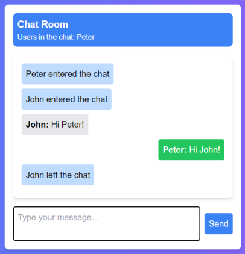

# ChatApp

ChatApp is a real-time chat application developed with Next.js and Express. It allows users to communicate instantly in a public chat room.

## Features

- **Real-Time Chat:** Enjoy seamless communication with instant message delivery in real-time. Whether it's exchanging thoughts, sharing ideas, or just chatting for fun, ChatApp ensures that your messages are delivered promptly, providing a smooth chatting experience for all users.

- **Custom Usernames:** Personalize your chat experience by setting your own unique username. Express your identity and make connections with others by choosing a username that reflects your personality. With custom usernames, users can easily recognize and interact with each other within the chat environment.

## Technologies Used

- **Frontend:**
  - [React](https://reactjs.org/): A powerful JavaScript library for building dynamic user interfaces, providing a robust foundation for ChatApp's frontend development.
  - [Next.js](https://nextjs.org/): Utilizing the benefits of server-side rendering and static site generation, Next.js enhances the performance and scalability of ChatApp's frontend, delivering a seamless user experience.
  - [Tailwind CSS](https://tailwindcss.com/): Leveraging Tailwind CSS's utility-first approach, ChatApp's frontend is styled with ease, enabling rapid development and customization of user interface components.

- **Backend:**
  - [Node.js](https://nodejs.org/): The server-side JavaScript runtime environment of choice for ChatApp's backend development, offering scalability and efficiency in handling server-side operations.
  - [Express](https://expressjs.com/): A flexible and minimalist web application framework for Node.js, Express simplifies the development of APIs and web servers, powering ChatApp's backend infrastructure.
  - [Socket.IO](https://socket.io/): Facilitating real-time bidirectional event-based communication, Socket.IO enables seamless interaction between clients and servers in ChatApp, ensuring instant message delivery and updates.

## Deployment

The frontend of ChatApp is deployed on [Vercel](https://chat-app-roan-rho.vercel.app/). The backend is deployed on a separate server implemented in the [chat-app-server](https://github.com/correa-rafael/chat-app-server) repository, ensuring efficient handling of server-side operations and maintaining the responsiveness of the chat application.

## Example

## Installation

To run ChatApp locally, follow these simple steps:

1. Clone this repository.
2. Navigate to the project directory.
3. Install dependencies using `npm install`.
4. Start the development server using `npm run dev`.

## Usage

Once the development server is running, access ChatApp by visiting `http://localhost:3000` in your web browser. Begin chatting instantly with other users in public chat rooms, exchange messages, and enjoy a seamless real-time chatting experience.

## Contributing

Contributions to ChatApp are always welcome! Whether it's through opening a pull request, submitting an issue, or providing feedback, your contributions help enhance and improve the application for all users.

## License

This project is licensed under the [MIT License](LICENSE), allowing for free usage, modification, and distribution of ChatApp.
